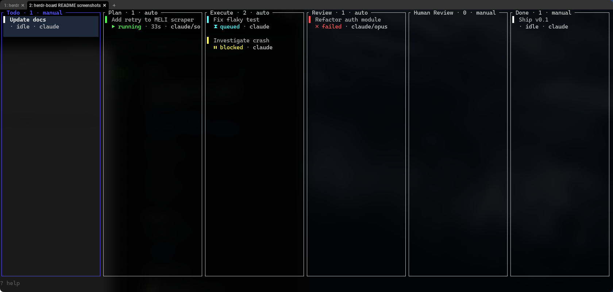
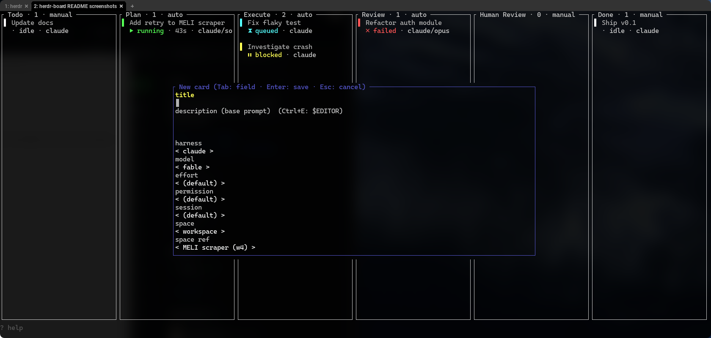
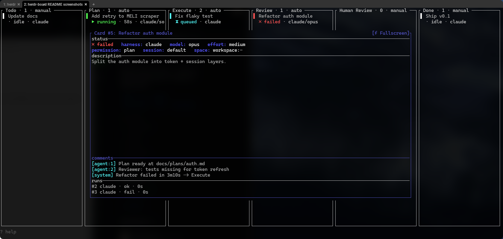
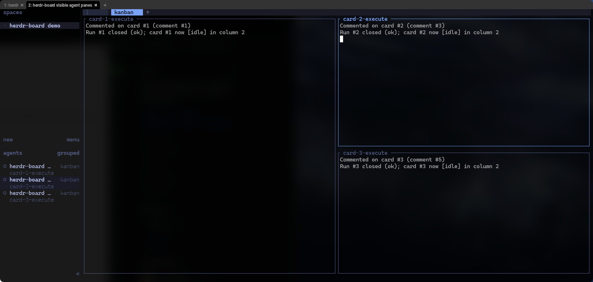

# herdr-board


**Turn a kanban card into a real AI coding agent running in a visible Herdr pane.** Cards hold
prompts, columns define pipeline stages, and moving work across the board can plan, execute, review,
and stop at human gates automatically.

<p align="center">
  
</p>

```text
Todo ──► Plan ──► Execute ──► Review ──► Human Review ──► Done
        (auto)    (auto)      (auto)     (manual gate)
```

Columns are fully user-defined. The pipeline above is an optional template; a new board starts with
only `Todo`.

## Why herdr-board?

- **Agents stay visible.** Runs open in the workspace's `kanban` tab, tiled into Herdr panes you can
  inspect while they work.
- **Pipelines, not just a queue.** Each column can prepend a system prompt and route successful or
  failed runs to another stage.
- **Human gates where they matter.** Automatic stages keep moving; manual columns stop the pipeline
  for approval.
- **One board per project.** The focused pane's Git root selects an independent pipeline; non-Git
  directories use their canonical CWD. The preserved `Global` board remains available with `b`.
- **One binary.** `board` provides the TUI, daemon, and CLI used by both humans and agents.
- **Session- and workspace-aware.** One daemon can dispatch cards across every Herdr session and
  existing or newly created workspaces.
- **History stays with the card.** Comments, runs, outcomes, retries, and archived cards remain
  available for inspection.

## Install

Requires exactly **Herdr 0.7.5 (protocol 17)**, Git, and a Rust toolchain with `cargo`. Linux
and macOS are supported. Ensure `~/.local/bin` is on your `PATH`.

The daemon checks the selected Herdr socket before workspace discovery and pane launch. It rejects
any Herdr version other than 0.7.5 and any protocol other than 17; protocol 16 is not supported.

```bash
herdr plugin install nelsonPires5/herdr-board
```

Precise live lifecycle status also requires Herdr's integration for the harness you dispatch (for
example, `herdr integration install pi`). Without that integration the board still dispatches and
accepts `board done`, but runs in degraded mode without precise working/blocked/done signals.

Open the board:

```bash
herdr plugin action invoke open-board --plugin herdr-board
```

To open the board as a tab instead of an overlay:

```bash
herdr plugin pane open --plugin herdr-board --entrypoint board --placement tab --focus
```

<details>
<summary><strong>Installation details and custom CLI directory</strong></summary>

Herdr first shows an interactive trust preview of the plugin's build commands. After approval it
checks out the source, builds the release binary, registers the plugin, and copies the CLI to
`~/.local/bin/board` as a regular executable. After reviewing the manifest and scripts, a
noninteractive install is available:

```bash
herdr plugin install nelsonPires5/herdr-board --yes
```

Set `HERDR_BOARD_CLI_INSTALL_DIR` to an absolute user bin directory before installing to override
`~/.local/bin`; the installed command is `<that-directory>/board`. The installer records the
binary's SHA-256 checksum in `<that-directory>/.herdr-board-cli-managed`. Updates only overwrite a
regular, non-symlink `board` whose contents still match that marker.

</details>

## Quickstart

1. Open the board with the plugin action or an optional keybinding. Herdr's focused pane selects
   its Git-root/CWD board; press `b` to switch boards or open the preserved `Global` board.
2. On an empty board press `T` to apply the example pipeline, or `N` to create your own columns.
3. Press `n` to create a card. Pi is selected by default. Leave model at `(default)` to use Pi's
   configured default, choose thinking effort if needed, then select the session and workspace.
   Permission appears only for harnesses that support it (Pi does not).
4. Move the card into an automatic column with `m`, `H` / `L`, or drag-and-drop.
5. Watch the agent appear in the workspace's `kanban` tab. Follow progress with `Enter` for card
   detail; the agent comments and calls `board done` when its stage finishes.

The same flow from the shell:

```bash
board card new --title "Add retry to the uploader" \
  -d "In src/upload.rs, retry failed PUTs 3x with backoff. Add a unit test." \
  --effort low \
  --space-kind new-workspace --space-ref uploader --space-cwd /path/to/repo
board move <new-card-id> Execute
```

`pi` is the default built-in harness. An omitted model lets Pi use its current configured default;
an explicit model uses Pi's `provider/model` form. Board effort maps to Pi `--thinking`. Pi has no
board permission mode and rejects `--permission`. Claude remains available explicitly with
`--harness claude` and keeps its model/effort/permission behavior.

## How it works

- A **card** contains a title, base prompt, harness/model/effort/permission settings, and a target
  Herdr session and workspace.
- A **column** can define a system prompt, automatic or manual triggering, timeout, and separate
  success/failure destinations.
- Moving a card into an automatic column queues a run. The daemon resolves the target session,
  opens or reuses the workspace, and starts the agent in a visible pane.
- The agent receives card/run environment variables and uses the `board` CLI to comment and report
  its outcome.
- The daemon applies the column transition. It either dispatches the next automatic stage or stops
  at a manual gate.

All board state lives under `~/.local/share/herdr-board/`; Herdr's own state is never modified.

## A closer look

| Guided card creation | Card context and run history |
|:--:|:--:|
|  |  |

### Agents run in visible Herdr panes

The daemon creates or reuses the workspace's `kanban` tab and tiles agent panes into a readable
grid.

<p align="center">
  
</p>

## Everyday controls

| Key | Action | Key | Action |
|---|---|---|---|
| `←/→` or `h/l` | Focus column | `↑/↓` or `k/j` | Focus card |
| `b` | Switch project/Global board | `n` | New card |
| `N` | New column | `Enter` | Card detail |
| `m` | Move card picker | `o` (detail) | Jump to latest run pane |
| `H / L` | Move card left/right | `a` | Archive/restore card |
| `e` | Edit card | `E` | Edit column |
| `v` | Active/all/archived view | `?` | Full help overlay |
| `q / Esc` | Back/quit | mouse drag | Move card/reorder column |

<details>
<summary><strong>Full keyboard and mouse reference</strong></summary>

| Key | Action | | Key | Action |
|---|---|---|---|---|
| `←/→ h/l` | focus column | | `Enter` | card detail |
| `↑/↓ k/j` | focus card | | `T` | apply template (empty board only) |
| `b` | switch board | | `r` | refresh board |
| `n` | new card | | `?` | help |
| `N` | new column | | `q / Esc` | back / quit |
| `e` | edit card | | **card detail** | |
| `E` | edit focused column | | `e` | edit card | |
| `a` | archive / restore card | | `a` | archive / restore card |
| `v` | active / all / archived view | | `f` / click title | popup / fullscreen |
| `d` | delete card | | `c` | add comment |
| `D` | delete column | | `Tab` | focus comments / runs |
| `m` | move card picker | | `↑/↓ k/j` | scroll focused detail section |
| `H / L` | move card left / right | | `o` | jump to latest same-session run pane |
| | | | `Enter` | confirm done (`awaiting` card) |
| **forms** | | | `x` / `r` | cancel / retry run |
| `Tab` / `Shift+Tab` | next / previous field | | `Tab`, `↑/↓` | choose/scroll detail history |
| `←/→ Space` | cycle a picker field | | **mouse** | |
| `Ctrl+E` | edit textarea in `$EDITOR` | | click / double-click | focus / open card detail |
| `Enter` / `Esc` | submit / cancel | | drag / wheel | move or scroll |

</details>

## Integration and optional setup

<details>
<summary><strong>Add a Herdr keybinding</strong></summary>

Plugin installation deliberately does not edit `~/.config/herdr/config.toml`. Add a command such as
this yourself (do not reuse a Herdr default; `prefix+k` is `focus_pane_up`, so check
`herdr --default-config`):

```toml
[[keys.command]]
key = "prefix+shift+k"
type = "shell"
command = "herdr plugin action invoke open-board --plugin herdr-board"
```

</details>

<details>
<summary><strong>Install the harness integration and optional agent skill</strong></summary>

For precise Pi status (`idle`, `working`, `blocked`, `done`) and session references, install Herdr's
Pi integration. Installation changes your personal Pi extension config, so herdr-board never does it
automatically — it is a user prerequisite. Without it (degraded mode), spawn, explicit `board done`,
timeout, and pane-exit handling still work, but Herdr's `working`/`blocked`/`done` signals do not
exist and a card can only reach `awaiting` (pending review) via the idle grace path.

```bash
herdr integration install pi
```

Claude users can similarly run `herdr integration install claude`. The repository's optional
[`skill/SKILL.md`](skill/SKILL.md) teaches interactive or dispatched agents to comment, call
`board done`, and queue work. GitHub plugin installation does not copy the skill; the
local-development installer below can do so.

</details>

<details>
<summary><strong>Use named Herdr sessions</strong></summary>

Herdr keeps a plugin registry per session, while keybindings/configuration are global. Run the
GitHub install command once from every named session where the plugin should be registered.

A single board daemon serves every scoped board across every Herdr session. Each card carries a
`session` (the default session when unset), and dispatch resolves that session's socket through
`herdr session list`. Use `BOARD_SOCKET` and `BOARD_DB` overrides only when you want a completely
separate board stack.

</details>

## CLI reference

<details>
<summary><strong>Show all board commands</strong></summary>

```text
board tui | daemon [--foreground] | status [--json]
board card new --title T [-d D] [--column C] [--harness H] [--model M] [--effort E] \
   [--permission P] [--session S] [--space-kind workspace|new-workspace] \
   [--space-ref R] [--space-cwd DIR]      # space-cwd required for new-workspace
board card show <ID> | card list [--column C] | card archive|restore <ID> | column list
board comment [CARD_ID] <BODY>            # CARD_ID defaults to $BOARD_CARD_ID
board done [CARD_ID] --outcome ok|fail [--summary S]
board move <CARD_ID> <COLUMN> | cancel <CARD_ID> | retry <CARD_ID>
board harness models [HARNESS] | efforts [HARNESS] --model M | permissions [HARNESS]
board space list [--session S] | session list    # HARNESS defaults to "pi"
```

Scope-sensitive CLI commands (`card new/list`, `column list`) use the current Git root, or the
canonical CWD outside Git. `BOARD_SCOPE_PATH` overrides this for automation. Operations by card id
remain independent of the caller's CWD; `move` resolves its destination in the card's own board.

`--json` is accepted everywhere. In the TUI, `d` permanently deletes a card after confirmation;
`D` deletes a column after asking where to move its cards, and refuses while a card is active.
Archiving is reversible with `a`, `board card archive <ID>`, and `board card restore <ID>`.

The pane title combines scope and filter, for example `Board [my-repo · ACTIVE]`. In card detail,
`o` focuses the latest recorded run pane only when it belongs to the current Herdr session; errors
leave the overlay open. Agent lifecycle rules and examples live
in [`skill/SKILL.md`](skill/SKILL.md).

</details>

## Configuration

<details>
<summary><strong>Configure the daemon and custom harnesses</strong></summary>

Configuration lives at `~/.config/herdr-board/config.toml`; override it with
`HERDR_BOARD_CONFIG`.

```toml
max_concurrent = 3         # global cap on concurrent runs
idle_grace_seconds = 90    # idle without board done before the card is parked in `awaiting` for review

[daemon]
spawner = "herdr"          # herdr = agent panes (default); local = child processes

[harness.myharness]
argv = ["mytool", "--model", "{model}"]
```

Custom harness prompts are delivered through `$BOARD_PROMPT`. The placeholders `{model}`, `{effort}`,
and `{permission_mode}` are available in `argv`.

### Environment variables

| Variable | Purpose |
|---|---|
| `BOARD_DB` | SQLite path. Default: `~/.local/share/herdr-board/board.db`. |
| `BOARD_SOCKET` | Daemon socket. Default: `~/.local/share/herdr-board/boardd.sock`. |
| `HERDR_BOARD_CONFIG` | Configuration path override. |
| `BOARD_SCOPE_PATH` | Canonicalizable scope override for CLI/TUI automation. |
| `BOARD_SPAWNER` | `herdr` or `local`; overrides `[daemon] spawner`. |
| `BOARD_CARD_ID` / `BOARD_RUN_ID` | Injected into runs; `comment`/`done` use them by default. |
| `BOARD_PROMPT` / `BOARD_SYSTEM_PROMPT` | Prompt delivery for custom harnesses. |
| `BOARD_TIMEOUT_UNIT_SECS` / `BOARD_LOCAL_POLL_MS` / `BOARD_TICK_MS` | Test-tuning knobs. |

</details>

## Maintenance

<details>
<summary><strong>Update</strong></summary>

Re-run the install command to update — Herdr has no separate update command, so reinstall over the
existing plugin:

```bash
herdr plugin install nelsonPires5/herdr-board --yes
```

The build step requests a graceful stop (`board daemon --stop`) before recompiling, so the new
binary replaces a stopped process instead of overwriting one the old daemon still has mapped in
memory. The command succeeds only after the daemon listener disappears. Stop failures and timeouts
are non-zero and preserve the socket; stale-socket cleanup is only performed after a fresh failed
connect and an identity check. The next `board` command auto-starts a fresh daemon from the new
binary.

Run the install once from each named Herdr session where the plugin is registered.

If you are updating from a version older than the `--stop` flag and a stale daemon is still
serving the old code, use your platform's process manager to stop that specific board process
(after verifying its PID and command) before reinstalling. Do not remove the socket or use a broad
process-name kill.

</details>

<details>
<summary><strong>Uninstall</strong></summary>

Herdr's plugin uninstall has no lifecycle hook and does not stop the board daemon — boardd is a
detached process Herdr does not track, so uninstalling the plugin leaves it running (and, after a
reinstall, serving stale code). Stop it first, then remove the CLI Herdr can't manage (only when
its checksum still matches the managed marker), then unregister the plugin:

```bash
if ! board daemon --stop; then
  echo "board daemon did not stop safely; socket preserved" >&2
  exit 1
fi
(
  if [ "${HERDR_BOARD_CLI_INSTALL_DIR+x}" = x ]; then
    install_dir="$HERDR_BOARD_CLI_INSTALL_DIR"
  else
    install_dir="${HOME:?HOME must be set}/.local/bin"
  fi
  case "$install_dir" in /*) ;; *) echo "Install directory must be absolute" >&2; exit 1;; esac

  board="$install_dir/board"
  marker="$install_dir/.herdr-board-cli-managed"
  prefix="herdr-board install-cli.sh managed board sha256:"
  if [ -f "$board" ] && [ ! -L "$board" ] && [ -f "$marker" ] && [ ! -L "$marker" ]; then
    checksum=""
    if command -v sha256sum >/dev/null 2>&1; then
      checksum_output="$(sha256sum <"$board")" && checksum="${checksum_output%% *}"
    elif command -v shasum >/dev/null 2>&1; then
      checksum_output="$(shasum -a 256 <"$board")" && checksum="${checksum_output%% *}"
    fi
    if [[ "$checksum" =~ ^[0-9a-f]{64}$ ]] && printf '%s\n' "$prefix$checksum" | cmp -s - "$marker"; then
      rm -- "$board" "$marker"
    else
      echo "board CLI was changed or is unrecognized; retaining $board and $marker" >&2
    fi
  else
    echo "board CLI was changed or is unrecognized; retaining $board and $marker" >&2
  fi
)
herdr plugin uninstall herdr-board
```

If `HERDR_BOARD_CLI_INSTALL_DIR` was used, use the same directory for every update and cleanup.
Uninstall the plugin from each named session where it was registered.

To remove all board data (cards, columns, runs), delete the data directory — `BOARD_DB`'s default
(`~/Library/Application Support/herdr-board` on macOS, `~/.local/share/herdr-board` on Linux).
This is optional and never needed for a normal reinstall.

</details>

<details>
<summary><strong>Local development / source install</strong></summary>

For a checkout you plan to edit, use `scripts/install.sh`. It prints proposed plugin links, skill
copies, PATH symlinks, and keybinding changes by default; `--yes` applies them.

```bash
git clone https://github.com/nelsonPires5/herdr-board
cd herdr-board
./scripts/install.sh                         # dry run
./scripts/install.sh --yes                   # default key: prefix+shift+k
./scripts/install.sh --yes --key prefix+shift+b
```

This broader development installer is intentionally separate from the GitHub plugin install flow.

</details>

## Architecture and development

<details>
<summary><strong>Components, documentation, scripts, and test commands</strong></summary>

### Components

| Role | Responsibility |
|---|---|
| `board daemon` | Owns SQLite state, run queue, orchestration, workspace resolution, pane spawning, and status watching. |
| `board tui` | Ratatui board opened inside a Herdr overlay/tab; talks to and auto-starts the daemon. |
| `board <verb>` | CLI used by humans and dispatched agents (`comment`, `done`, `move`, and others). |

Workspace crates:

- `board-core`: models, protocol, database, engine, prompts, config, and harness adapters;
- `board-daemon`: orchestration and dispatch;
- `board-herdr`: Herdr socket client;
- `board-tui`: Ratatui application;
- `board-cli`: the `board` binary.

The CLI and TUI share `board_core::client::BoardClient`: typed wrappers own method names,
wire parameters, and response decoding for board, harness, space, session, and run actions.
The Unix-socket transport retains only the raw request primitive; production clients do not access SQLite.

### Documentation

- [`docs/README.md`](docs/README.md) — documentation index;
- [`docs/design.md`](docs/design.md) — architecture and full data flow;
- [`docs/protocol.md`](docs/protocol.md) — daemon socket protocol;
- [`docs/herdr.md`](docs/herdr.md) — verified Herdr commands and API facts;
- [`docs/research.md`](docs/research.md) — capability map, prior art, and harness flags;
- [`docs/implementation.md`](docs/implementation.md) — crate layout and build phases;
- [`docs/testing.md`](docs/testing.md) — testing pyramid and live scenarios;
- [`docs/releasing.md`](docs/releasing.md) — release policy;
- [`schema.sql`](schema.sql) — SQLite migration source of truth.

### Scripts

- `scripts/build.sh` — release build used by plugin installation;
- `scripts/install-cli.sh` — managed CLI copy;
- `scripts/install.sh` — local-development setup;
- `scripts/open-board.sh` — open-or-focus plugin action;
- `scripts/board-rpc.py` — raw daemon protocol client;
- `e2e/` — live end-to-end suite against disposable Herdr sessions/workspaces.

### Test gates

```bash
cargo test --workspace --all-features
cargo clippy --all-targets -- -D warnings
cargo fmt --all --check
./e2e/run-all.sh
```

See [`CONTRIBUTING.md`](CONTRIBUTING.md) and [`AGENTS.md`](AGENTS.md) before contributing.

</details>

## Status

**v1.** Rust with Ratatui, Rusqlite, and Tokio. Pi is the default built-in harness and Claude Code
remains explicitly selectable; config-defined harnesses are also supported. Execution happens in
visible Herdr panes, and extension-owned state remains separate from Herdr's state.

## License

MIT — see the `license` field in [`Cargo.toml`](Cargo.toml).
