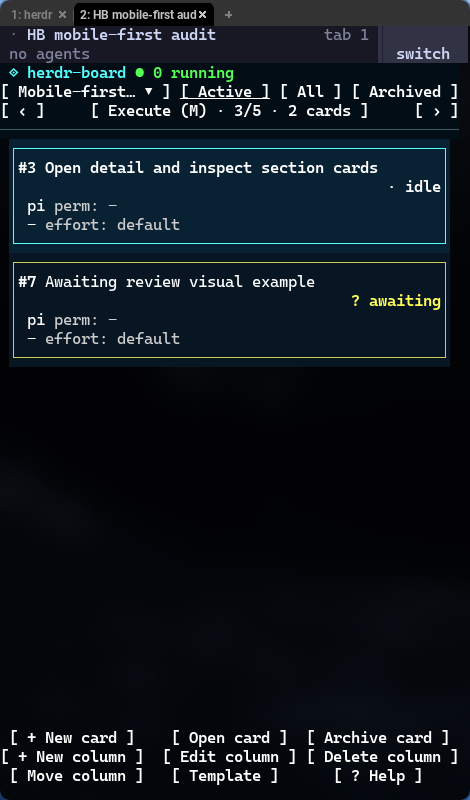

# herdr-board


**Turn a kanban card into a real AI coding agent running in a visible Herdr pane.** Cards hold
prompts, columns define pipeline stages, and moving work across the board can plan, execute, review,
and stop at human gates automatically.

<p align="center">
  
</p>

```text
Todo ──► Plan ──► Execute ──► Review ──► Human Review ──► Done
        (auto)    (auto)      (auto)     (manual gate)
```

Columns are fully user-defined. The pipeline above is an optional template; a new board starts with
only `Todo`.

## Why herdr-board?

- **Agents stay visible.** New runs open in a stable per-card `card-<id>` Herdr tab. A managed tab converges to exactly its one harness pane — the shell anchor is closed once the launch succeeds — while configured harnesses keep a persistent anchor because their child exits with the run.
- **Pipelines, not just a queue.** Each column can prepend a system prompt and route successful or
  failed runs to another stage.
- **Human gates where they matter.** Automatic stages keep moving; manual columns stop the pipeline
  for approval.
- **One board per project.** The focused pane's Git root selects an independent pipeline; non-Git
  directories use their canonical CWD. The preserved `Global` board remains available with `b`.
- **One binary.** `board` provides the TUI, daemon, and CLI used by both humans and agents.
- **Session- and workspace-aware.** One daemon can dispatch cards across every Herdr session and
  existing or newly created workspaces.
- **History stays with the card.** Comments, runs, outcomes, retries, and archived cards remain
  available for inspection.

## Install

Requires exactly **Herdr 0.8.0 (protocol 19)**, Git, and a Rust toolchain with `cargo`. Linux
and macOS are supported. Ensure `~/.local/bin` is on your `PATH`. The board protocol is v1 and the
current SQLite schema is v13; `schema.sql` defines fresh databases and the daemon applies tested
upgrades through `board-core::db`.

The daemon checks the selected Herdr socket before workspace discovery and pane launch. It rejects
any Herdr version other than 0.8.0 and any protocol other than 19; older, unknown, and future
protocols are not supported.

```bash
herdr plugin install nelsonPires5/herdr-board --ref v0.13.0
```

Precise live lifecycle status also requires Herdr's integration for the harness you dispatch (for
example, `herdr integration install pi`). Without that integration the board still dispatches and
accepts `board done`, but runs in degraded mode without precise working/blocked/done signals.

Open the board:

```bash
herdr plugin action invoke open-board --plugin herdr-board
```

To open the board as a tab instead of an overlay:

```bash
herdr plugin pane open --plugin herdr-board --entrypoint board --placement tab --focus
```

For a custom CLI install directory, a Herdr keybinding, the harness integration, the optional
agent skill, and named-session notes, see [`docs/install.md`](docs/install.md).

## Quickstart

1. Open the board with the plugin action or an optional keybinding. Herdr's focused pane selects
   its Git-root/CWD board; press `b` to switch boards or open the preserved `Global` board.
2. On an empty board press `T` to apply the example pipeline, or `N` to create your own columns.
3. Press `n` to create a card. Pi is selected by default. Leave model at `(default)` to use Pi's
   configured default, choose thinking effort if needed, then select the session and workspace.
   Permission appears only for harnesses that support it (Pi does not; Codex offers
   `untrusted|on-request|never`; OpenCode offers `default|auto-approve`).
4. Move the card into an automatic column with `m`, `H` / `L`, or drag-and-drop.
5. Watch the agent appear in its stable `card-<id>` workspace tab. Follow progress with `Enter`
   for card detail; the agent comments and calls `board done` when its stage finishes.

The same flow from the shell:

```bash
board card create --title "Add retry to the uploader" \
  -d "In src/upload.rs, retry failed PUTs 3x with backoff. Add a unit test." \
  --effort low \
  --space-kind new-workspace --space-ref uploader --space-cwd /path/to/repo
board move <new-card-id> Execute
```

`pi` is the default built-in harness. An omitted model lets Pi use its current configured default;
an explicit model uses Pi's `provider/model` form. Board effort maps to Pi `--thinking`. Pi has no
board permission mode and rejects `--permission`. Claude remains available explicitly with
`--harness claude` and keeps its model/effort/permission behavior. Codex is the third built-in:
`--harness codex` keeps free-form model entry and also discovers visible models plus per-model
efforts from `$CODEX_HOME/models_cache.json`. Board effort `off` becomes Codex
`model_reasoning_effort=none`. Its permission selector mirrors Codex: `ask-for-approval`
(workspace-write + on-request), `approve-for-me` (automatic reviewer), or `full-access` (no sandbox
or approvals). Codex mints its own thread id — the board never invents one — and captures the
integration-reported id after launch so later stages can `resume`/`fork` the same conversation.
OpenCode is the fourth built-in: `--harness opencode` treats models as free-form
`provider/model` (the daemon discovers live models plus per-model reasoning variants from
`opencode models --verbose`, falling back to a static catalog that truthfully lists OpenCode Zen
Nemotron 3 Ultra Free — `opencode/nemotron-3-ultra-free`, which declares no variants and so offers
no board effort — alongside a fixture model `opencode/deepseek-v4-flash-free` with `low`/`high`/`max`
efforts). The board calls the variant dimension **effort**; the root/TUI has **no `--variant` flag**
(verified: it exists only on `opencode run`), so an effort is applied through a process-local
`OPENCODE_CONFIG_CONTENT` config defining a stable `herdr-board` agent with exactly `model` +
`variant` (board `off` → opencode `none`), selected with `--agent herdr-board`, and `--variant`
never rides argv. Its two permission modes are
`default` (no flag) and `auto-approve` (`--auto`). Like Codex, OpenCode mints its own `ses_…`
session id — a Mint carries no session flag and persists `NULL` until the integration-reported id is
captured after launch, so later stages can `resume`/`fork` the same conversation by id.

## How it works

- A **card** contains a title, base prompt, harness/model/effort/permission settings, and a target
  Herdr session and workspace.
- A **column** can define a system prompt, automatic or manual triggering, timeout, and separate
  success/failure destinations.
- Moving a card into an automatic column queues a run. The daemon resolves the target session,
  opens or reuses the workspace, and starts the agent in a visible pane.
- The agent receives card/run environment variables and uses the `board` CLI to comment and report
  its outcome.
- The daemon applies the column transition. It either dispatches the next automatic stage or stops
  at a manual gate.

Runtime launch ownership stays in `board-daemon`: it owns Herdr pane placement and process handles,
and runs an always-on per-session supervisor that reconnects conservatively after outages.

All board state lives under `~/.local/share/herdr-board/`; Herdr's own state is never modified.

## A closer look

| Guided card creation | Card context and run history |
|:--:|:--:|
|  |  |

### Agents run in visible Herdr panes

The daemon creates one stable `card-<id>` tab per new card. For a workspace the daemon itself
just created (`new_workspace`), that workspace's own initial tab is adopted as the card tab —
renamed to `card-<id>` — so no unused initial tab is left behind. The tab's root is reserved as a
labeled `card-<id>-anchor` shell and every run is split into a child from it. A successful
**managed** (Pi/Claude/Codex/OpenCode) launch then closes the anchor, leaving exactly the harness pane
visible; **configured** harnesses keep the anchor because their child exits with the run. Ownership is
proven from durable pane identity, never from a matching label, so a user tab is never adopted.
The full placement and recovery rules are in [`docs/design.md`](docs/design.md).

<p align="center">
  
</p>

## Mobile-first TUI

The `board tui` surface is responsive: **Compact (< 60 cols)** shows one
full-width column with a three-row mobile header — product/running count, a
board dropdown plus visibility chips, then the column navigator — while
**Regular (60–119)** and **Wide (≥ 120)** show the multi-column board with all
header controls balanced on one line. Compact navigation shows the column
trigger as `(M)` or `(A)` and never repeats the global running count. Filter
chips shorten only when needed; they never add a redundant `Board:` or
`Visible:` label. Cards are compact boxed rows that always carry their real
status glyph, an active-run timer, and harness/model metadata; Board cards have
no Edit/Delete controls, while keyboard `e`/`d` remains available. Every
visible button is a transparent `[ NAME ]` chip with bold white text and
brackets; close controls are always `[ X ]`, selected chips add an underline,
and primary/destructive tone does not recolor them. Card detail, forms, and
picker sheets occupy only the board content region, leaving persistent top and
bottom action rails visible. Multiline description and system-prompt fields
retain wrapped editing and `$EDITOR` support while using the same focused and
unfocused value treatment as title/name fields. The old persistent footer hint
row is gone; only transient toasts use its former space. All original keyboard
shortcuts are preserved.

Compact adapts to smaller screens and is touch-friendly when the terminal maps
taps to pointer clicks: navigation, filters, cards, and action chips are all
tappable/clickable. This is pointer-click support rather than native swipe or
pinch gestures; keyboard shortcuts remain available too.

<p align="center">
  
</p>

## Everyday controls

| Key | Action | Key | Action |
|---|---|---|---|
| `←/→` or `h/l` | Focus column | `↑/↓` or `k/j` | Focus card |
| `b` | Switch project/Global board | `n` | New card |
| `N` | New column | `Enter` | Card detail |
| `m` | Move card picker | `o` (detail) | Jump to selected run's pane |
| `H / L` | Move card left/right | `a` | Archive/restore card |
| `e` | Edit card | `E` | Edit column |
| `v` | Active/all/archived view | `?` | Full help overlay |
| `q / Esc` | Back/quit | mouse drag | Move card/reorder column |

<details>
<summary><strong>Full keyboard and mouse reference</strong></summary>

| Key | Action | | Key | Action |
|---|---|---|---|---|
| `←/→ h/l` | focus column | | `Enter` | card detail |
| `↑/↓ k/j` | focus card | | `T` | apply template (empty board only) |
| `b` | switch board | | `r` | refresh board |
| `n` | new card | | `?` | help |
| `N` | new column | | `q / Esc` | back / quit |
| `e` | edit card | | **card detail** | |
| `E` | edit focused column | | `e` | edit card | |
| `a` | archive / restore card | | `a` | archive / restore card |
| `v` | active / all / archived view | | `f` / click title | popup / fullscreen |
| `d` | delete card | | `c` | add comment |
| `D` | delete column | | `Tab` | focus comments / runs |
| `m` | move card picker | | `↑/↓ k/j` | select comment / run (section follows) |
| `H / L` | move card left / right | | `o` | jump to the selected run's same-session pane |
| | | | `Enter` | confirm done (`awaiting` card) |
| **forms** | | | `x` / `r` | cancel / retry run |
| `Tab` / `Shift+Tab` | next / previous field | | `Tab`, `↑/↓` | choose/scroll detail history |
| `←/→ Space` | cycle a picker field | | **mouse** | |
| `Ctrl+E` | edit textarea in `$EDITOR` | | click / double-click | focus / open card detail |
| `Enter` / `Esc` | submit / cancel | | drag / wheel | move or scroll |

</details>

## CLI at a glance

`board` is one binary with a nested canonical taxonomy. **[`skill/SKILL.md`](skill/SKILL.md) is the
full reference** — every flag, every return shape, and the agent lifecycle rules. `board skill`
prints those exact bytes, so a dispatched agent can read the contract it is held to.

`--board` and `--json` are **global**: both parse before or after the subcommand.

```bash
board --board <ID|PATH> card list --json
board card list --board <ID|PATH> --json     # identical
```

`--board` takes a stable board id or canonical scope path. Without it, board-aware commands use the
focused Git root (or canonical non-Git CWD; `BOARD_SCOPE_PATH` overrides both). Card-id operations
infer the card's own board; `card create`, `card list`, `column list`, and board commands use the
selected/current board.

| Noun | Verbs |
|---|---|
| `board board` | `list`, `show`, `open`, `rename` |
| `board template` | `apply <NAME>` |
| `board card` | `create` (alias `new`), `edit`, `show`, `list`, `move`, `archive`, `restore`, `delete` |
| `board card comment` | `add`, `show`, `edit`, `delete`, `history` |
| `board card run` | `done`, `confirm`, `cancel`, `retry`, `focus` |
| `board column` | `list`, `create`, `show`, `edit`, `reorder`, `delete` |
| `board harness` | `list`, `models`, `efforts`, `permissions` |
| `board space` / `board session` | `list` |
| `board tui` · `board daemon` · `board version` · `board skill` | see below |

Legacy top-level forms stay supported and re-dispatch into the nested handlers: `board comment`,
`board done`, `board move`, `board cancel`, `board retry`. `card new` and `--to-board` remain
aliases. Cross-board `move` should use `--destination-board`; the old global-`--board` fallback still
works but warns on stderr.

### Daemon

```text
board daemon start [--foreground]     # run boardd in this process
board daemon stop [--json]            # graceful stop -> {"stopped":bool,"was_running":bool}
board daemon status [--json]          # {version, db_path, herdr_connected, active_runs, queued_runs}
```

Bare `board daemon` still runs the daemon, and the historical `--foreground` / `--stop` flags still
work but are hidden from `--help`. `board version [--json]` never starts boardd and reports
`{cli_version, daemon_version}`, with `null`/`unavailable` when boardd is offline.

### JSON and exit codes

Successful `--json` goes to stdout; JSON errors go to stderr with stdout left empty, in the stable
envelope `{"error":{"code":N,"kind":"...","message":"...","details":...}}` (`kind` and `details` are
additive and may be absent). Errors from the daemon carry its protocol code; errors the CLI itself
raised carry `{"code":64,"kind":"cli"}`.

The exit status carries the same number, so scripts branch on `$?` instead of parsing stderr:

| Code | Meaning |
|---|---|
| `0` | Success |
| `1`–`5` | Daemon protocol code: bad request, not found, invalid state, Herdr unavailable, internal |
| `64` | The CLI itself refused — usage/parse error, declined confirmation, bad enum value, unresolvable column, missing `$BOARD_CARD_ID` (`EX_USAGE`) |
| `70` | Daemon reported a protocol code outside `1..=5`, clamped (`EX_SOFTWARE`) |

## Configuration and maintenance

- [`docs/configuration.md`](docs/configuration.md) — `config.toml`, `[daemon]` settings,
  config-defined harnesses, and every environment variable;
- [`docs/operations.md`](docs/operations.md) — update, uninstall, and local-development
  source install.

## Architecture and development

| Role | Responsibility |
|---|---|
| `board daemon` | Owns SQLite state, run queue, orchestration, workspace resolution, pane spawning, and status watching. |
| `board tui` | Ratatui board opened inside a Herdr overlay/tab; talks to and auto-starts the daemon. |
| `board <verb>` | CLI used by humans and dispatched agents (`comment`, `done`, `move`, and others). |

Five workspace crates — `board-core` (models, protocol, database, engine, prompts, config, harness
adapters), `board-daemon` (orchestration and dispatch), `board-herdr` (Herdr socket client),
`board-tui` (Ratatui application), and `board-cli` (the `board` binary). The CLI and TUI share the
typed `board_core::client::BoardClient`; only boardd touches SQLite.

- **[`docs/README.md`](docs/README.md) — the documentation index** (design, protocol, herdr facts,
  implementation, testing, releasing) and the single maintained copy of the
  [test gates](docs/README.md#test-gates-single-source);
- [`CONTRIBUTING.md`](CONTRIBUTING.md) and [`AGENTS.md`](AGENTS.md) — read before contributing;
- [`schema.sql`](schema.sql) — SQLite migration source of truth;
- `scripts/` — `build.sh` (release build used by plugin installation), `install-cli.sh` (managed
  CLI copy), `install.sh` (local-development setup), `open-board.sh` (open-or-focus plugin
  action), and `board-rpc.py` (raw daemon protocol client);
- `e2e/` — scenarios 01–32 against disposable Herdr sessions/workspaces; checked-in fake Pi,
  Claude, Codex, OpenCode, and configured harnesses keep the standard suite provider-free. `e2e/test-harness.sh`
  performs static ownership/safety checks without starting Herdr; the live suite is a separate
  gate. The catalog is [`e2e/README.md`](e2e/README.md).

## Status

**v1 board protocol / schema v13 / Herdr 0.8.0 (protocol 19).** Rust with Ratatui, Rusqlite, and
Tokio. See [`docs/README.md`](docs/README.md) for the full version and source-ownership matrix.

## License

MIT — see the `license` field in [`Cargo.toml`](Cargo.toml).
